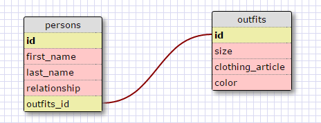

1. Select all data for all states.

SELECT * FROM states;

2. Select all data for all regions.

SELECT * FROM regions;

3. Select the state_name and population for all states.

SELECT state_name, population
FROM states;

4. Select the state_name and population for all states ordered by population. The state with the highest population should be at the top.

SELECT state_name, population
FROM states
ORDER BY population DESC;

5. Select the state_name for the states in region 7.

SELECT state_name
FROM states
WHERE region_id = 7;

6. Select the state_name and population_density for states with a population density over 50 ordered from least to most dense.

SELECT state_name, population_density
FROM states
WHERE population_density > 50
ORDER BY population_density ASC;

7. Select the state_name for states with a population between 1 million and 1.5 million people.

SELECT state_name
FROM states
WHERE population
BETWEEN 1000000 AND 1500000;

8. Select the state_name and region_id for states ordered by region in ascending order.

SELECT state_name, region_id
FROM states
ORDER BY region_id ASC;

9 Select the region_name for regions with "Central" in the name.

SELECT region_name
FROM regions
WHERE region_name
LIKE '%Central%';

10. Select the region_name and the state_name for all states and regions in ascending order by region_id. Refer to the region by name (This will involve joining the tables).

SELECT region_name, state_name
FROM regions
INNER JOIN states
ON
regions.id=states.region_id
ORDER BY region_id ASC;

Release 6: Your Own Schema

Reflection:

**What are databases for?**
Databases are for storing large/complex amounts of data and allow us to easily access/find the stored data.

**What is a one-to-many relationship?**
A one-to-many relationship is a name for when one variable or data point belongs or falls under many different categories. An example of that would be "Jimmy Butler belongs to the Chicago Bulls, the Chicago Bulls have many players."

**What is a primary key? What is a foreign key? How can you determine which is which?**
A primary key is a key that is the main unique indentifier for content within a table. A foreign key is a primary key within another table. It can show up numerous times in another table, but can only show up once in as a primary key within its primary table. You can determine which is which, because the primary key will always have one unique value or identifier that is linked only to that table.

**How can you select information out of a SQL database? What are some general guidelines for that?**

We can select information out of a SQL database by typing SELECT followed by the column name then FROM followed by the table name and a number of features that we want to sort the information by. Some general guidelines for selecting information out of a database are that the method must always be capitalized and the end of our call statement must have a semicolon.
